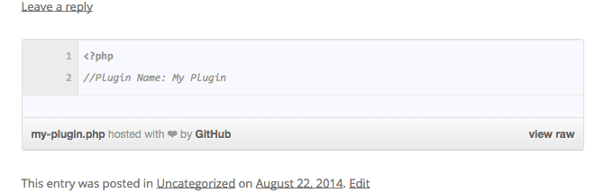
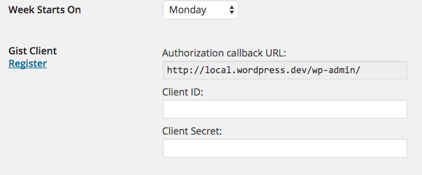
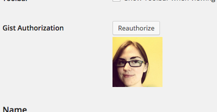

# Shortcode Gists

Turn `[gist]...[/gist]` into an embedded gist. Why? get the benefits of Gists while keeping the code in your post to benefit site-search.

This:

```
[gist filename='my-plugin.php' description='a plugin that does stuff']&lt;?php
//Plugin Name: My Plugin
[/gist]
```
becomes:



---

With the nature of code in the content editor, relatively simple snippets recommended. Also, it's not smart enough to detect a minor change and update for you - any changes to the shortcode contents (except for whitespace) will cause a new gist to be created.

---

## First, configure your application

You'll need to register an application on Github and enter your client information General Settings




## Second, authorize your user

Go to your profile and authorize. 



Now, when you author a post, any `[gist]`s will be associated with your github/gist acount.